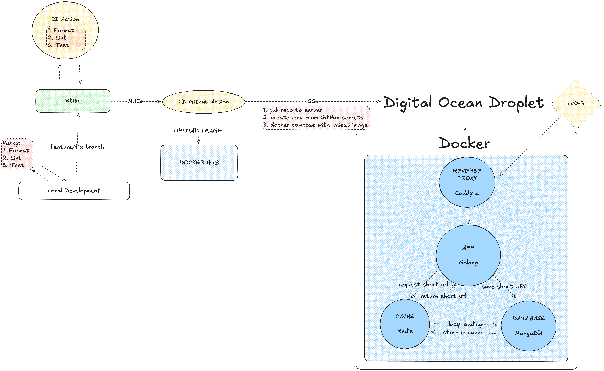
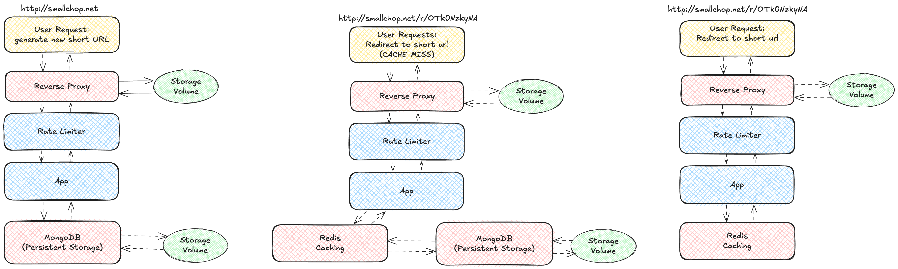

# SmallChop

SmallChop is a containerized Go URL shortener with an HTMX interface, MongoDB persistence, Redis caching, and Caddy ingress. It runs one Go application service alongside its database, cache, and reverse proxy using Docker Compose.

The project demonstrates HTTP request handling, cache-aside reads, proxy trust configuration, and repeatable local development. Tests and local integration checks cover the behavior described below; throughput and latency have not been established by a reproducible benchmark.

The previous public domain and hosting have expired. The current runnable demonstration is local. For setup and troubleshooting, see the [contribution guide](contribution.md#running-locally).

## Stack

| Component | Role |
| --- | --- |
| Go | HTTP handlers, short-code encoding, and repository integration |
| HTMX and Go templates | Form submission and server-rendered results |
| MongoDB | Persistent URL mappings, sequential IDs, and access counts |
| Redis | Cached redirect destinations with a one-hour TTL |
| Caddy | Public ingress and production TLS; loopback HTTP locally |
| Docker Compose | Single-host application and dependency deployment |
| GitHub Actions | Formatting, lint, race tests, fuzz checks, and manual delivery workflow |

Version details and development commands are in the [contribution guide](contribution.md#development-checks-and-dependency-baseline).

## Architecture and request flow

Caddy is the only service with published host ports. A dedicated proxy network connects it to the Go application; MongoDB and Redis use the backend network. The app trusts forwarded client identity only from Caddy's configured IP.

| Route | Behavior |
| --- | --- |
| `GET /` | Renders the shortening form |
| `POST /shorten` | Validates one destination, stores or reuses a MongoDB mapping, and returns a link using the configured public origin |
| `GET /r/{code}` | Resolves a destination from Redis or MongoDB and returns a 308 redirect |

Redis caches destinations loaded from MongoDB. Every successful redirect also attempts a synchronous MongoDB access-count update, including cache hits. Cache hits therefore avoid a lookup but still perform a database write; they do not establish database-independent redirects.

The image exports below provide an overview. They predate the latest request and network changes; the route table and configuration describe the current behavior.





The original deployment design uses Docker Compose on a single DigitalOcean Droplet. Keeping one Go application alongside its database, cache, and reverse proxy makes the deployment proportionate to this project's scope. The current configuration does not provide multi-host availability or coordinated rate limits across replicas.

## Verified behavior

- Real handler and route tests cover URL creation, redirects, invalid inputs, body limits, and unsupported methods. Valid HTTP(S) destinations retain their escaping, query strings, and fragments. Generated links use an explicit public origin rather than the request's Host header.
- Short-code tests cover canonical positive IDs, invalid characters, overflow, and round trips; CI also runs bounded fuzz checks.
- Creation and redirects have separate configurable limits. Middleware tests and an isolated Caddy integration check verified independent client allowances and resistance to forged forwarding headers from untrusted peers.
- Fresh local Compose startup, create/redirect smoke checks through Caddy, and persistence across a retained-volume restart were verified in disposable projects. Local startup checks cover authenticated dependencies and HTTP availability.

See the [request contract and configuration](contribution.md#request-behavior-and-configuration) for exact limits and status behavior, and the [local smoke commands](contribution.md#running-locally) to reproduce the basic flow. These checks do not measure capacity or prove outage recovery.

## Current limits

Dependency failure handling is incomplete: fallback can repeat a MongoDB lookup, and a final lookup error is currently reported as 404 even when the database is unavailable. Application-level dependency deadlines, runtime readiness/metrics endpoints, and outage-recovery verification are still absent.

The deployment is designed for one host and one application instance. Sequential-ID codes are predictable and provide no access control; the service also does not assess destination reputation. No current public uptime, repeatable performance result, or rehearsed release rollback is claimed.

## CI and delivery

[CI](.github/workflows/go-ci.yml) runs on pull requests and pushes to `main`. It rejects Go formatting changes, validates local Compose configuration and helper syntax, runs golangci-lint and race-enabled tests, and exercises bounded encoding/decoding fuzz targets. Coverage is uploaded as a diagnostic artifact without a percentage gate. Local commit hooks run formatting, lint, and tests.

[CD](.github/workflows/go-cd.yml) requires manual dispatch. It builds and publishes a Docker Hub image, then connects to the configured host, pulls `main` and the image, appends environment configuration, and restarts the Compose stack.

Production Compose declares a source build for the app rather than selecting the published image explicitly, so pulling that image does not ensure it is the one deployed. The workflow does not gate deployment on successful tests of the same commit or provide an immutable release/verified rollback. Existing MongoDB data also requires a supported upgrade path before changing server major versions. See [deployment configuration](contribution.md#deployment-configuration) before using the manual workflow.

## Repository layout

```text
cmd/server/                 Application entry point
internal/                   Go packages, tests, and HTML templates
deploy/
  docker-compose.yml        Production Compose configuration
  compose.local.yml         Disposable local Compose configuration
  caddy/                    Production and local Caddyfiles
  mongo/                    MongoDB initialization script
  env/                      Example environment files
scripts/                    Local lifecycle and HTTP smoke helpers
docs/assets/                Published architecture diagrams
docs/bruno/                 API request collection
.github/workflows/          CI and manual CD
.husky/hooks/               Local commit checks
Dockerfile                  Application image build
contribution.md             Setup, configuration, checks, and contribution guidance
```

## Contributing

See [contribution.md](contribution.md) for local setup, configuration, troubleshooting, and pull request guidance.

## References and further reading

- The [tutorial by Annis Souames](https://getstream.io/blog/url-shortener/) informed the original HTMX, Go, and Redis implementation.
- This [discussion of bijective functions](https://stackoverflow.com/questions/742013/how-do-i-create-a-url-shortener) informed the short-code algorithm.
- This [Caddy and Nginx comparison by Tyler Langlois](https://blog.tjll.net/reverse-proxy-hot-dog-eating-contest-caddy-vs-nginx/) provides further reading on reverse proxy tradeoffs.
