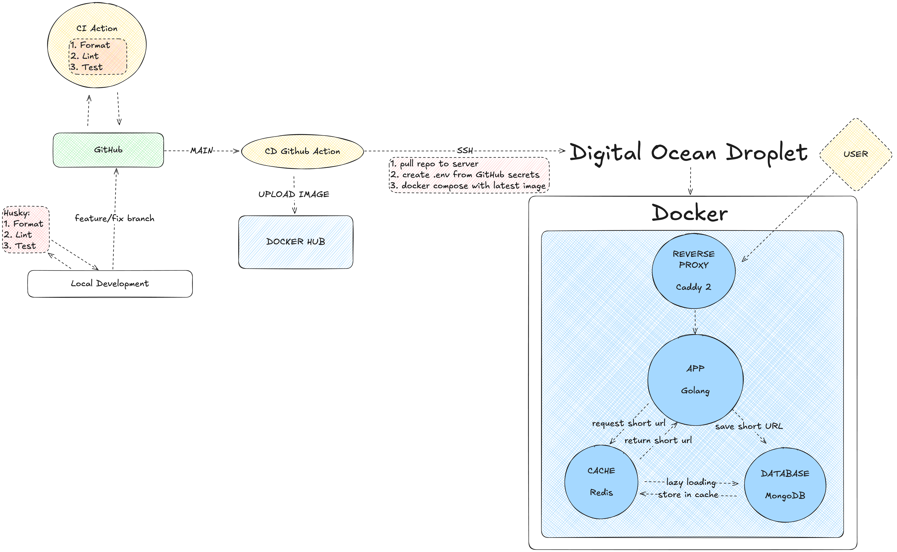
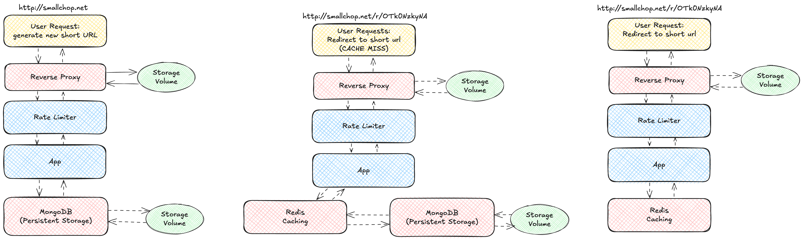

# SmallChop

SmallChop is a URL shortener built with Go, crafted for scalability and high performance. Designed to handle high traffic seamlessly, SmallChop offers fast and reliable URL shortening with a simple, containerized setup that's easy to deploy.

Designed as a lightweight, containerized application, SmallChop leverages Docker and a microservice-oriented architecture to deliver quick, reliable URL shortening and redirection.
It features a caching layer with Redis for ultra-fast access to frequently requested URLs, persistent storage with MongoDB, and a reverse proxy with Caddy for secure, seamless HTTPS access.

With a robust CI/CD pipeline for automated deployment, SmallChop is a production-ready solution that balances efficiency and scalability, making it ideal for handling high-traffic environments with ease.

## Tech Stack:

### Core Technologies

-   Go:
    -   Powers the URL shortening service, providing high performance and efficient concurrency for handling requests.
-   HTMX:
    -   Manages the entire front-end interactivity through server-driven templates. It allows dynamic updates by injecting values directly from server responses, simplifying the frontend and enabling a highly responsive UI.
-   Redis:
    -   Serves as a caching layer, ensuring frequently accessed URLs are retrieved quickly. This helps reduce load on the database and improves response times.
-   MongoDB:
    -   Provides persistent storage for original URLs and their shortened counterparts. MongoDB’s document-based structure allows flexible storage of URL data.
-   Caddy:
    -   Acts as the reverse proxy and TLS provider, enabling secure HTTPS access and efficient routing of requests to the backend service.

### Development & Deployment Tools

-   Docker:
    -   Containerizes each service (Go app, Redis, MongoDB, and Caddy) to ensure consistency across development, testing, and production environments. Docker Compose is used to manage multi-container setups.
-   Husky:
    -   Implements pre-commit hooks for formatting, linting, and running tests locally, helping enforce code quality standards before changes are committed.
-   gofmt:
    -   Automatically formats Go code, maintaining a consistent coding style across the project.
-   golangci-lint:
    -   Runs static analysis on Go code to catch potential errors, improve code quality, and enforce best practices.
-   go test:
    -   Used for running unit tests, ensuring that the application functions as expected and helping prevent regressions.
-   GitHub Actions:
    -   Powers CI/CD, building and pushing Docker images to Docker Hub and automating deployment to the production server.

## High Level Diagram

The architecture diagram below illustrates SmallChop’s core components, showing how user requests are managed through a reverse proxy, caching layer, and database for high efficiency.


<details>
<summary>Click here for a discussion about scaling this service.</summary>

In an enterprise environment, SmallChop would typically be deployed with Kubernetes to enable high scalability and manageability. By using Kubernetes, the application could run across multiple pods and nodes, allowing for automatic scaling in response to traffic spikes. This setup would also enable seamless updates and rollbacks through Kubernetes’ built-in deployment strategies, such as rolling updates. Additionally, a load balancer would be essential to distribute incoming traffic evenly across instances, ensuring high availability and minimizing latency. This would also allow easy integration of a more robust secret manager than what is currently implemented in this project.

However, for a project of this scale and purpose, using Kubernetes and a load balancer would be overkill. Instead, SmallChop is deployed using Docker Compose on a single DigitalOcean Droplet, which provides a streamlined, cost-effective environment suitable for demonstration and portfolio purposes. This approach keeps infrastructure simple while showcasing containerized microservices architecture. It maintains the essential components—caching, persistent storage, and reverse proxy—while remaining accessible and manageable for a smaller deployment. This setup can later be adapted to a more advanced Kubernetes environment if needed, making SmallChop flexible and adaptable for future growth.

</details>

## Architecture and App Routes
SmallChop exposes routes for creating, retrieving, and redirecting shortened URLs, with caching mechanisms for high-frequency requests.


<details>
<summary>click here for a simple text diagram of the app architecture.</summary>

## Architecture

```
            +---------------------+
            |     User Requests   |
            +---------------------+
                      |
                      v
         +----------------------------+
         |      URL Shortener API     |
         |        (Go Service)        |
         +----------------------------+
                      |
                      v
  +------------------------------------------+
  |          Caching Layer (Redis)           |
  +------------------------------------------+
                      |
                      v
  +------------------------------------------+
  |       Persistent Storage (MongoDB)       |
  +------------------------------------------+
```

## MVP Architecture

```
            +---------------------+
            |     User Requests   |
            +---------------------+
                      |
                      v
         +----------------------------+
         |      URL Shortener API     |
         |        (Go Service)        |
         +----------------------------+
                      |
                      v
  +------------------------------------------+
  |            Redis as a DB                 |
  +------------------------------------------+
```

</details>

## CI / CD Pipelines

### Pre-Commit (Local)

#### Husky

Husky pre-commit hooks ensure that basic formatting, linting, and tests are enforced on all changes before they're committed, while GitHub Actions provides continuous integration and deployment to maintain code quality across environments.

### GitHub Actions

#### **CI Pipeline**

Ensures that code quality is maintained consistently across different environments and that no one bypasses quality checks.

#### **CD Pipeline**

The CD pipeline consists of two primary jobs:

1. Build Job: Handles code checkout, builds the Docker image, and pushes it to DockerHub.
2. Deploy Job: Connects to the production server and deploys the latest Docker image.

## App Setup

### CI/CD Workflow

1. Add relevant secrets to GitHub repository.
    - You'll need to add the following:
        - Dockerhub token, and username.
        - Deployment secrets (This example uses Digital Ocean)
        - A copy of your production .env file.

### Running Locally

#### Prerequisites

Ensure you have the following installed on your system:

-   Docker (version 20.10 or higher)
-   Docker Compose (version 1.29 or higher)
-   Git

#### Installation

1. Clone the Repo

```
git clone https://github.com/xdaybreakerx/SmallChop
cd ./SmallChop
```

2. Set up environment variables

    - Copy `.env.example` to `.env` and update the environment variables accordingly.
    - Ensure that `.env` is **not** committed to version control.

3. Running the app locally

```
docker-compose up --build
```

4. Accessing the application

    - Web Application: http://localhost:${APP_PORT} (default is http://localhost:8080)
    - Redis: Not exposed externally
    - MongoDB: Not exposed externally

5. Services overview
 <details>
 <summary>click here for summaries of each microservice.</summary>

app Service

-   Build Context: The current directory (contains your application’s Dockerfile)
-   Ports: Exposes port 8080 (or as defined in .env)
-   Depends On: redis, mongo
-   Environment Variables: Loaded from .env

redis Service

-   Image: redis:alpine
-   Command: Starts Redis with a password from .env
-   Environment Variables: Loaded from .env
-   Ports: Not exposed externally

mongo Service

-   Image: mongo:latest
-   Volumes:
    -   mongo-data for persistent storage
-   mongo-user-init.js for initialization
-   Environment Variables: Loaded from .env
-   Ports: Not exposed externally

caddy Service (Production Only)

-   Image: caddy:2.8.4-alpine
-   Ports:
    -   Exposes port 80 for HTTP
    -   Exposes port 443 for HTTPS
-   Volumes:
    -   caddy_data for Caddy data
    -   caddy_config for configuration
-   Caddyfile for server configuration
-   Environment Variables: Loaded from .env

Additional Notes

-   Data Persistence: Volumes are used for MongoDB and Caddy to ensure data persists between container restarts.
-   Environment Variables: Keep the .env file secure, especially in production.
-   Docker Compose Override: The docker-compose.override.yml file is used to customize the Compose configuration for local development.

    </details>

6. Cleaning Up

To stop and remove all containers, networks, and volumes created by Docker Compose:

```
docker-compose down -v
```

#### Troubleshooting

-   Ports Already in Use:
    -   Ensure that the ports defined in docker-compose.yml and .env are not being used by other applications.
-   Environment Variables Not Loaded:
    -   Double-check the .env file and ensure all necessary variables are defined.
-   Permission Issues:
    -   If you encounter permission issues with volumes, adjust the permissions or run Docker with appropriate privileges.

### Todo

<details>
<summary>click here for the todo list</summary>

-   [x] pre commit hooks
-   [x] testing
-   [x] rate limiter
-   [x] persistent storage
-   [x] caching layer
-   [x] cd with github actions
-   [x] deployment
-   [ ] better shortener algo

</details>
